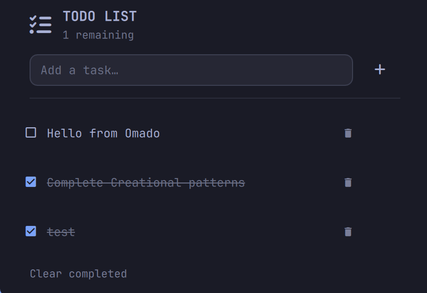

# Omado

A minimal todo list bar widget for [Omarchy](https://omarchyplugins.com/).

 


Add, complete, and clear tasks right from your bar. Tasks are stored locally in
`~/.local/state/omarchy/settings/maduki-tech.todo.json` — no accounts, no network.

## Features

- Add tasks from the bar popup (Enter to confirm)
- Quick Add overlay from a global keyboard shortcut
- Open tasks stay above completed tasks automatically
- Clear all completed tasks in one click
- Live "remaining" counter in the panel header
- Keyboard friendly: Esc closes, Tab switches panels

## Quick Add Shortcut

Omado exposes the global shortcut action `maduki-tech.omado:quick-add`. Bind it
to any key combination in your Hyprland bindings, for example:

```lua
o.bind("SUPER + SHIFT + T", nil, hl.dsp.global("maduki-tech.omado:quick-add"))
```

Reload Hyprland after adding the binding. Press the shortcut, enter a task, and
press Enter. Escape or clicking outside the dialog closes it without adding a
task. The plugin does not modify Hyprland configuration.

## Installation

Omado is a bar widget for the Omarchy shell (Quickshell). Install with the
Omarchy CLI:

```sh
omarchy plugin add https://github.com/Maduki-tech/Omado --enable
```

Or clone it manually:

```sh
git clone https://github.com/Maduki-tech/Omado ~/.config/omarchy/plugins/maduki-tech.omado
omarchy plugin enable maduki-tech.omado
```

## Removal

```sh
omarchy plugin remove maduki-tech.omado
```

This removes the plugin and its bar entry. Your saved tasks live in
`~/.local/state/omarchy/settings/maduki-tech.todo.json`; delete that file to clear
your data.

## Requirements

- Omarchy (Quickshell shell). No other external dependencies.

## License

[MIT](LICENSE)
